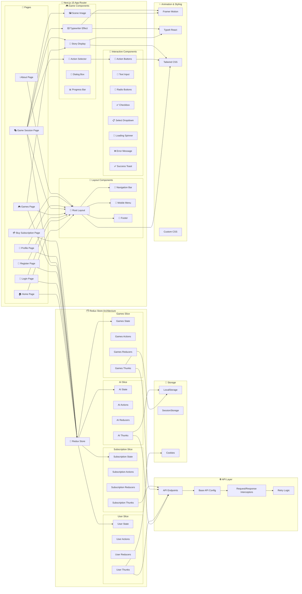
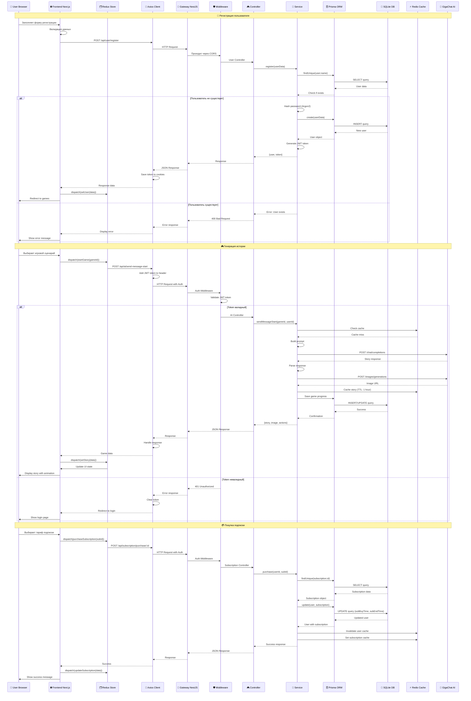

<div align="center">

<!-- Banner -->

```
██████╗ ██╗   ██╗███████╗████████╗ ██████╗ ███████╗████████╗ ██████╗ ██████╗ ██╗   ██╗
██╔══██╗██║   ██║██╔════╝╚══██╔══╝██╔═══██╗██╔════╝╚══██╔══╝██╔═══██╗██╔══██╗╚██╗ ██╔╝
██████╔╝██║   ██║███████╗   ██║   ██║   ██║███████╗   ██║   ██║   ██║██████╔╝ ╚████╔╝ 
██╔═══╝ ██║   ██║╚════██║   ██║   ██║   ██║╚════██║   ██║   ██║   ██║██╔══██╗  ╚██╔╝  
██║     ╚██████╔╝███████║   ██║   ╚██████╔╝███████║   ██║   ╚██████╔╝██║  ██║   ██║   
╚═╝      ╚═════╝ ╚══════╝   ╚═╝    ╚═════╝ ╚══════╝   ╚═╝    ╚═════╝ ╚═╝  ╚═╝   ╚═╝   
```

# 🎭 JustStory

### ✨ Интерактивные игры-сторителеры с искусственным интеллектом GigaChat

[](https://github.com/ETsETs777/scasGigaChat/releases)
[](https://nodejs.org/)
[](https://www.typescriptlang.org/)
[](https://nextjs.org/)
[](https://nestjs.com/)
[](LICENSE)
[](https://github.com/ETsETs777/scasGigaChat/graphs/commit-activity)

**🎮 Платформа для создания и прохождения уникальных текстовых приключений с использованием GigaChat AI**

[🌟 Demo](#-демонстрация) • [📦 Установка](#-быстрый-старт) • [📖 Документация](#-документация) • [🤝 Вклад](#-вклад-в-проект) • [🐛 Issues](https://github.com/ETsETs777/scasGigaChat/issues)

---

[](https://github.com/ETsETs777/scasGigaChat)
[](https://github.com/ETsETs777/scasGigaChat/fork)
[](https://github.com/ETsETs777/scasGigaChat)

---

</div>

## 📑 Содержание

<details>
<summary>📋 Нажмите, чтобы развернуть</summary>

- [📖 О проекте](#-о-проекте)
  - [✨ Основные возможности](#-основные-возможности)
  - [🎯 Для кого этот проект](#-для-кого-этот-проект)
- [🎥 Демонстрация](#-демонстрация)
- [🛠️ Технологический стек](#️-технологический-стек)
  - [🔧 Backend](#-backend)
  - [🎨 Frontend](#-frontend)
  - [📊 Статистика проекта](#-статистика-проекта)
- [🚀 Быстрый старт](#-быстрый-старт)
  - [📋 Требования](#-требования)
  - [⚡ Установка за 3 шага](#-установка-за-3-шага)
  - [🎬 Пример использования](#-пример-использования)
- [📁 Структура проекта](#-структура-проекта)
- [🎮 Основной функционал](#-основной-функционал)
  - [🔐 Аутентификация и авторизация](#-аутентификация-и-авторизация)
  - [🎯 Игровые сценарии](#-игровые-сценарии)
  - [👤 Профиль пользователя](#-профиль-пользователя)
  - [💳 Система подписок](#-система-подписок)
- [🔧 API Endpoints](#-api-endpoints)
  - [🤖 AI Module](#-ai-module-apiai)
  - [👤 User Module](#-user-module-apiuser)
  - [💳 Subscription Module](#-subscription-module-apisubscription)
  - [💻 Примеры запросов](#-примеры-запросов)
- [🏗️ Архитектура проекта](#️-архитектура-проекта)
- [🛡️ Безопасность](#️-безопасность)
- [🎨 Особенности UI/UX](#-особенности-uiux)
- [🔄 Улучшения и оптимизации](#-улучшения-и-оптимизации)
- [📚 Документация](#-документация)
- [🗺️ Roadmap](#️-roadmap)
- [🐛 Известные проблемы](#-известные-проблемы)
- [❓ FAQ](#-faq)
- [🤝 Вклад в проект](#-вклад-в-проект)
- [👨‍💻 Авторы](#-авторы)
- [📞 Поддержка](#-поддержка)
- [⭐ Благодарности](#-благодарности)

</details>

---

## 📖 О проекте

**JustStory** — это полнофункциональная платформа нового поколения для создания и прохождения интерактивных текстовых приключений. Приложение использует передовые технологии искусственного интеллекта (GigaChat) для генерации динамических историй, где каждый выбор пользователя влияет на развитие сюжета в реальном времени.

### ✨ Основные возможности

<div align="center">

| 🎯 Функционал | 📝 Описание | 🚀 Статус |
|:--------------:|:-------------:|:---------:|
| 🤖 **AI-генерация историй** | Уникальные сюжеты генерируются искусственным интеллектом GigaChat в реальном времени | ✅ Готово |
| 🎮 **Интерактивные сценарии** | Каждый выбор действий влияет на развитие истории, создавая уникальный опыт | ✅ Готово |
| 🖼️ **Генерация изображений** | AI создает визуализацию сцен для лучшего погружения в историю | ✅ Готово |
| 👤 **Система подписок** | Гибкая система монетизации с различными тарифными планами | ✅ Готово |
| 🔐 **Безопасная аутентификация** | JWT токены и Argon2 для шифрования паролей | ✅ Готово |
| 📱 **Адаптивный дизайн** | Полная поддержка всех устройств: десктоп, планшет, мобильные | ✅ Готово |
| ⚡ **Высокая производительность** | Redis кеширование и оптимизация запросов | ✅ Готово |
| 💾 **Автосохранение прогресса** | Прогресс игры автоматически сохраняется в localStorage | ✅ Готово |
| 🎨 **Анимации** | Плавные анимации и эффект печатающегося текста | ✅ Готово |
| 🔄 **Обработка ошибок** | Продвинутая система обработки ошибок и retry логика | ✅ Готово |

</div>

### 🎯 Для кого этот проект

- 🎮 **Для игроков** — любители интерактивных текстовых приключений
- 📚 **Для разработчиков** — пример современного full-stack приложения
- 🤖 **Для энтузиастов AI** — интеграция GigaChat AI в реальный проект
- 🎓 **Для студентов** — изучение NestJS, Next.js, TypeScript на практике
- 💼 **Для бизнеса** — готовая платформа для монетизации через подписки

---

## 🎥 Демонстрация

<div align="center">

### 📹 Видео демонстрации проекта

<a href="https://vkvideo.ru/video-48212115_456239182">
  
</a>

**👉 [Смотреть на VK Video](https://vkvideo.ru/video-48212115_456239182)**

> 💡 **Примечание:** Видео демонстрирует все основные возможности приложения, включая регистрацию, выбор сценариев, взаимодействие с AI и систему подписок.

</div>

---

## 🛠️ Технологический стек

### 🔧 Backend

<div align="center">

<table>
<tr>
<td align="center" width="200">
<br/>
<sub><b>NestJS 10</b></sub><br/>
<sub>🟢 Прогрессивный Node.js фреймворк</sub>
</td>
<td align="center" width="200">
<br/>
<sub><b>Prisma ORM</b></sub><br/>
<sub>🟢 Современный ORM</sub>
</td>
<td align="center" width="200">
<br/>
<sub><b>Redis</b></sub><br/>
<sub>🟢 Кеширование данных</sub>
</td>
<td align="center" width="200">
<br/>
<sub><b>Swagger</b></sub><br/>
<sub>🟢 API документация</sub>
</td>
</tr>
</table>

</div>

| Технология | Версия | Назначение |
|:----------:|:------:|:----------:|
| **NestJS** | 10.x | Прогрессивный Node.js фреймворк для построения эффективных серверных приложений |
| **Prisma ORM** | 5.x | Современный ORM для работы с базой данных с type-safety |
| **SQLite** | 3.x | Легковесная база данных для хранения пользователей и подписок |
| **Redis** | 7.x | In-memory хранилище для кеширования данных и повышения производительности |
| **GigaChat AI** | Latest | Искусственный интеллект для генерации динамического контента |
| **JWT** | 9.x | Токен-базированная аутентификация пользователей |
| **Argon2** | 0.41 | Безопасное хеширование паролей (winner of Password Hashing Competition) |
| **Swagger** | 8.x | Автоматическая генерация интерактивной API документации |

### 🎨 Frontend

<div align="center">

<table>
<tr>
<td align="center" width="200">
<br/>
<sub><b>Next.js 15</b></sub><br/>
<sub>⚡ React-фреймворк</sub>
</td>
<td align="center" width="200">
<br/>
<sub><b>React 19</b></sub><br/>
<sub>⚛️ UI библиотека</sub>
</td>
<td align="center" width="200">
<br/>
<sub><b>TypeScript 5</b></sub><br/>
<sub>📘 Типизация</sub>
</td>
<td align="center" width="200">
<br/>
<sub><b>Redux Toolkit</b></sub><br/>
<sub>🗂️ State management</sub>
</td>
</tr>
<tr>
<td align="center" width="200">
<br/>
<sub><b>Tailwind CSS</b></sub><br/>
<sub>🎨 Utility-first CSS</sub>
</td>
<td align="center" width="200">
<br/>
<sub><b>Framer Motion</b></sub><br/>
<sub>✨ Анимации</sub>
</td>
<td align="center" width="200">
<br/>
<sub><b>Axios</b></sub><br/>
<sub>📡 HTTP клиент</sub>
</td>
<td align="center" width="200">
<br/>
<sub><b>npm</b></sub><br/>
<sub>📦 Пакетный менеджер</sub>
</td>
</tr>
</table>

</div>

| Технология | Версия | Назначение |
|:----------:|:------:|:----------:|
| **Next.js** | 15.x | React-фреймворк с App Router для продакшена и SSR |
| **React** | 19.x | Библиотека для создания пользовательских интерфейсов |
| **TypeScript** | 5.x | Типизированный JavaScript для надежности кода |
| **Redux Toolkit** | 2.x | Управление глобальным состоянием приложения |
| **Tailwind CSS** | 3.x | Утилитарный CSS-фреймворк для быстрой разработки |
| **Framer Motion** | 11.x | Библиотека для создания плавных и сложных анимаций |
| **TypeIt React** | 2.x | Анимация печатающегося текста для истории |
| **Axios** | 1.x | HTTP-клиент для работы с REST API |
| **js-cookie** | 3.x | Работа с cookies для хранения токенов |

### 📊 Статистика проекта

<div align="center">

| 📈 Метрика | 🔢 Значение |
|:----------:|:-----------:|
| **Версия** | v1.0.0 |
| **Коммитов** | 55+ |
| **Веток** | main |
| **Размер проекта** | ~50 MB |
| **Строк кода** | 10,000+ |
| **Файлов TypeScript** | 100+ |

</div>

---

## 🚀 Быстрый старт

> 💡 **Подробная инструкция:** См. [DEPLOYMENT.md](DEPLOYMENT.md) для детального руководства по развертыванию

### 📋 Требования

<div align="center">

| 🛠️ Инструмент | 📦 Минимальная версия | 🔗 Ссылка |
|:-------------:|:---------------------:|:---------:|
| **Node.js** | 18.0.0 | [Download](https://nodejs.org/) |
| **npm** | 9.0.0 | (Входит в Node.js) |
| **Docker** | 20.10+ | [Download](https://www.docker.com/) |
| **Git** | 2.30+ | [Download](https://git-scm.com/) |

</div>

### ⚡ Установка за 3 шага

<details>
<summary><b>1️⃣ Клонирование репозитория</b></summary>

```bash
# Клонируйте репозиторий
git clone https://github.com/ETsETs777/scasGigaChat.git

# Перейдите в директорию проекта
cd scasGigaChat
```

✅ Репозиторий успешно клонирован!

</details>

<details>
<summary><b>2️⃣ Настройка Backend</b></summary>

```bash
# Перейдите в директорию backend
cd juststory_backend

# Установите зависимости
npm install

# Создайте файл .env с конфигурацией
cat > .env << EOF
AI_TOKEN=your_gigachat_token
JWT_SECRET=your_jwt_secret_key
DATABASE_URL="file:./dev.db"
EOF

# Сгенерируйте JWT_SECRET (опционально)
node -e "console.log(require('crypto').randomBytes(32).toString('hex'))"

# Инициализируйте базу данных
npx prisma generate
npx prisma migrate dev

# Запустите Redis через Docker
docker run --name redis -p 6379:6379 -d redis

# Или, если контейнер уже существует
docker start redis

# Запустите backend в режиме разработки
npm run start:dev
```

✅ **Backend запущен!**  
🌐 Доступен по адресу: `http://localhost:4202`  
📚 Swagger документация: `http://localhost:4202/swagger`

</details>

<details>
<summary><b>3️⃣ Настройка Frontend</b></summary>

```bash
# Откройте новый терминал и перейдите в директорию frontend
cd juststory_frontend

# Установите зависимости
npm install

# Создайте файл .env.local
cat > .env.local << EOF
NEXT_PUBLIC_API_URL=http://localhost:4202/api
EOF

# Запустите frontend в режиме разработки
npm run dev
```

✅ **Frontend запущен!**  
🌐 Доступен по адресу: `http://localhost:3000`

</details>

### 🎬 Пример использования

После запуска приложения:

```bash
# 1. Откройте браузер и перейдите на http://localhost:3000
# 2. Зарегистрируйте новый аккаунт или войдите в систему
# 3. Выберите игровой сценарий
# 4. Начните взаимодействовать с AI-историей
# 5. Выбирайте действия и наблюдайте, как история развивается
```

---

## 📁 Структура проекта

```
scasGigaChat/
│
├── 📂 juststory_backend/              # Backend приложение (NestJS)
│   ├── 📂 src/
│   │   ├── 🤖 ai/                     # AI модуль (GigaChat интеграция)
│   │   │   ├── ai.controller.ts       # REST API контроллер
│   │   │   ├── ai.service.ts          # Бизнес-логика AI
│   │   │   └── ai.module.ts           # NestJS модуль
│   │   ├── 👤 user/                   # Модуль пользователей
│   │   │   ├── user.controller.ts
│   │   │   ├── user.service.ts
│   │   │   └── user.module.ts
│   │   ├── 💳 subscription/           # Модуль подписок
│   │   │   ├── subscription.controller.ts
│   │   │   ├── subscription.service.ts
│   │   │   └── subscription.module.ts
│   │   ├── ⏰ subscription-checker/   # Проверка подписок
│   │   │   └── subscription-checker.service.ts
│   │   ├── 🗄️ prisma/                # Prisma конфигурация
│   │   │   ├── schema.prisma          # Схема БД
│   │   │   └── prisma.service.ts      # Prisma сервис
│   │   └── 📦 redis/                  # Redis модуль
│   │       └── redis.module.ts
│   ├── 📂 prisma/
│   │   ├── migrations/                # Миграции БД
│   │   └── schema.prisma
│   ├── 📄 package.json
│   ├── 📄 tsconfig.json
│   └── 📄 .env                        # Переменные окружения (не в Git)
│
├── 📂 juststory_frontend/             # Frontend приложение (Next.js)
│   ├── 📂 app/                        # Next.js App Router
│   │   ├── page.tsx                   # Главная страница
│   │   ├── login/                     # Страница входа
│   │   ├── register/                  # Страница регистрации
│   │   ├── games/                     # Игровые сценарии
│   │   ├── profile/                   # Профиль пользователя
│   │   └── layout.tsx                 # Общий layout
│   ├── 📂 lib/                        # Redux store
│   │   ├── 📂 entities/               # Redux слайсы
│   │   │   ├── ai/
│   │   │   ├── games/
│   │   │   ├── subscription/
│   │   │   └── user/
│   │   └── store.ts                   # Конфигурация store
│   ├── 📂 src/
│   │   ├── 📂 components/             # Переиспользуемые компоненты
│   │   │   ├── ErrorBoundary/
│   │   │   ├── Logo/
│   │   │   └── Toast/
│   │   ├── 📂 entities/               # Бизнес-сущности
│   │   └── 📂 utils/                  # Утилиты
│   ├── 📄 package.json
│   ├── 📄 next.config.ts
│   └── 📄 .env.local                  # Переменные окружения (не в Git)
│
├── 📄 README.md                       # Главный README (этот файл)
├── 📄 DEPLOYMENT.md                   # Инструкция по развертыванию
└── 📄 .gitignore                      # Git ignore файл
```

---

## 🎮 Основной функционал

### 🔐 Аутентификация и авторизация

<div align="center">

| 🔑 Функция | ✅ Статус | 📝 Описание |
|:---------:|:--------:|:----------:|
| Регистрация пользователей | ✅ | Регистрация с валидацией данных |
| Вход в систему | ✅ | Авторизация через JWT токены |
| Проверка токена | ✅ | Автоматическая валидация на каждом запросе |
| Защищенные маршруты | ✅ | Редирект на страницу входа для неавторизованных |
| Автоматический logout | ✅ | Выход при истечении токена |
| Восстановление пароля | ⏳ | В разработке |

</div>

### 🎯 Игровые сценарии

<div align="center">

| 🎮 Функция | ✅ Статус | 📝 Описание |
|:---------:|:--------:|:----------:|
| Просмотр сценариев | ✅ | Каталог доступных игровых сценариев |
| Поиск и фильтрация | ✅ | Поиск сценариев с debounce оптимизацией |
| Запуск сценария | ✅ | Выбор и запуск игрового сценария |
| AI взаимодействие | ✅ | Генерация истории через GigaChat |
| Анимация текста | ✅ | Эффект печатающегося текста |
| Выбор действий | ✅ | Сделать / Сказать / Событие |
| Генерация изображений | ✅ | AI создает визуализацию сцен |
| Автосохранение | ✅ | Прогресс сохраняется в localStorage |

</div>

### 👤 Профиль пользователя

- ✅ Просмотр информации о пользователе
- ✅ Управление подпиской
- ✅ История активности (в разработке)
- ✅ Выход из системы

### 💳 Система подписок

- ✅ Просмотр доступных тарифов
- ✅ Покупка подписки с подтверждением
- ✅ Автоматическая проверка истечения подписок
- ✅ Уведомления о подписке (в разработке)

---

## 🔧 API Endpoints

### 🤖 AI Module (`/api/ai`)

| Метод | Endpoint | Описание | Auth |
|:-----:|:--------:|:--------:|:----:|
| `POST` | `/api/ai/send-message-start` | Генерация начальной истории | ✅ |
| `POST` | `/api/ai/send-message` | Продолжение истории на основе выбора | ✅ |
| `POST` | `/api/ai/get-actions` | Получение вариантов действий | ✅ |
| `POST` | `/api/ai/generate-img` | Генерация изображения для сцены | ✅ |

### 👤 User Module (`/api/user`)

| Метод | Endpoint | Описание | Auth |
|:-----:|:--------:|:--------:|:----:|
| `POST` | `/api/user/register` | Регистрация нового пользователя | ❌ |
| `POST` | `/api/user/login` | Вход в систему | ❌ |
| `GET` | `/api/user/` | Получение профиля пользователя | ✅ |
| `GET` | `/api/user/validate-token` | Валидация токена | ✅ |

### 💳 Subscription Module (`/api/subscription`)

| Метод | Endpoint | Описание | Auth |
|:-----:|:--------:|:--------:|:----:|
| `GET` | `/api/subscription/` | Получение списка подписок | ❌ |
| `POST` | `/api/subscription/purchase/:id` | Покупка подписки | ✅ |
| `GET` | `/api/subscription/check` | Проверка статуса подписки | ✅ |

> 📚 **Полная документация API:** После запуска backend, Swagger UI доступен по адресу `http://localhost:4202/swagger`

### 💻 Примеры запросов

<details>
<summary><b>📝 Пример: Регистрация пользователя</b></summary>

```bash
curl -X POST http://localhost:4202/api/user/register \
  -H "Content-Type: application/json" \
  -d '{
    "name": "username",
    "password": "securepassword123"
  }'
```

**Ответ:**
```json
{
  "token": "eyJhbGciOiJIUzI1NiIsInR5cCI6IkpXVCJ9...",
  "user": {
    "id": 1,
    "name": "username",
    "role": "User"
  }
}
```

</details>

<details>
<summary><b>📝 Пример: Генерация истории</b></summary>

```bash
curl -X POST http://localhost:4202/api/ai/send-message-start \
  -H "Content-Type: application/json" \
  -H "Authorization: Bearer YOUR_TOKEN" \
  -d '{
    "gameId": "cybertron",
    "userId": 1
  }'
```

**Ответ:**
```json
{
  "message": "Вы находитесь в заброшенном космическом корабле...",
  "image": "https://generated-image-url.com/image.jpg"
}
```

</details>

---

## 🏗️ Архитектура проекта

<div align="center">

### 🎯 Общая архитектура системы

```mermaid
graph TB
    subgraph "👤 Пользовательский уровень"
        USER1[💻 Десктоп браузер]
        USER2[📱 Мобильный браузер]
        USER3[📱 Планшет браузер]
    end

    subgraph "🌐 Frontend Layer - Next.js 15"
        subgraph "📱 UI Components"
            COMP1[🎨 Layout Components]
            COMP2[📄 Page Components]
            COMP3[🔄 Interactive Components]
            COMP4[🎭 Game Components]
            COMP5[👤 User Components]
            COMP6[💳 Subscription Components]
            COMP7[❌ Error Boundary]
            COMP8[🔔 Toast Notifications]
        end

        subgraph "⚡ Client State Management"
            REDUX[🗂️ Redux Toolkit Store]
            SLICE1[AI Slice]
            SLICE2[User Slice]
            SLICE3[Games Slice]
            SLICE4[Subscription Slice]
        end

        subgraph "💾 Local Storage"
            LOCAL1[🎮 Game Progress]
            LOCAL2[🔑 Auth Tokens]
            LOCAL3[⚙️ User Preferences]
        end

        subgraph "📡 API Client Layer"
            AXIOS[🌐 Axios HTTP Client]
            INTERCEPTOR[🛡️ Request Interceptors]
            RETRY[🔄 Retry Logic]
            ERROR_HANDLER[❌ Error Handler]
        end

        subgraph "🎨 Styling & Animation"
            TAILWIND[🎨 Tailwind CSS]
            FRAMER[✨ Framer Motion]
            TYPEIT[⌨️ TypeIt React]
        end
    end

    subgraph "🔒 Security Layer"
        JWT_CLIENT[JWT Token Manager]
        COOKIE[🍪 js-cookie]
        VALIDATION[✅ Client Validation]
    end

    subgraph "🚀 Backend Layer - NestJS 10"
        subgraph "🌐 API Gateway"
            GATEWAY[Express Platform]
            MIDDLEWARE1[🔐 Auth Middleware]
            MIDDLEWARE2[📝 Validation Middleware]
            MIDDLEWARE3[📊 Logging Middleware]
            CORS[🌍 CORS Handler]
        end

        subgraph "🎮 Controllers Layer"
            CTRL1[🤖 AI Controller]
            CTRL2[👤 User Controller]
            CTRL3[💳 Subscription Controller]
            CTRL4[⏰ Subscription-Checker Controller]
        end

        subgraph "🧠 Services Layer"
            SERVICE1[🤖 AI Service]
            SERVICE2[👤 User Service]
            SERVICE3[💳 Subscription Service]
            SERVICE4[⏰ Subscription-Checker Service]
            SERVICE5[🔐 Auth Service]
            SERVICE6[📊 Cache Service]
        end

        subgraph "🤖 AI Module"
            GIGACHAT[🧠 GigaChat API Client]
            PROMPT_MANAGER[📝 Prompt Manager]
            RETRY_LOGIC[🔄 Retry Logic with Exponential Backoff]
            IMAGE_GENERATOR[🖼️ Image Generator]
            STORY_GENERATOR[📖 Story Generator]
            ACTION_GENERATOR[🎯 Action Generator]
        end

        subgraph "👤 User Module"
            REGISTER[📝 Registration Service]
            LOGIN[🔑 Login Service]
            PROFILE[👤 Profile Service]
            TOKEN_VALIDATOR[✅ Token Validator]
            PASSWORD_HASHER[🔐 Argon2 Hasher]
        end

        subgraph "💳 Subscription Module"
            SUB_LIST[📋 Subscription List]
            SUB_PURCHASE[💰 Purchase Service]
            SUB_CHECKER[✅ Status Checker]
            SUB_SCHEDULER[⏰ Expiration Scheduler]
        end

        subgraph "📊 Data Access Layer"
            PRISMA[🗄️ Prisma ORM]
            PRISMA_CLIENT[🔌 Prisma Client]
            MIGRATIONS[📦 Migrations]
            SCHEMA[📋 Schema Definition]
        end

        subgraph "⚡ Cache Layer"
            REDIS_MODULE[📦 Redis Module]
            REDIS_CLIENT[🔌 Redis Client]
            CACHE_MANAGER[💾 Cache Manager]
            USER_CACHE[👤 User Cache]
            SUB_CACHE[💳 Subscription Cache]
        end

        subgraph "📚 Documentation"
            SWAGGER[📖 Swagger UI]
            API_DOCS[📝 API Documentation]
        end
    end

    subgraph "💾 Data Storage Layer"
        SQLITE[(🗄️ SQLite Database)]
        TABLES[📊 Tables: User, Subscription]
        MIGRATIONS_DB[📦 Migration Files]
    end

    subgraph "⚡ In-Memory Cache"
        REDIS[(🔴 Redis Server)]
        REDIS_KEYS[🔑 Cache Keys]
        REDIS_EXPIRE[⏰ TTL Management]
    end

    subgraph "🌐 External Services"
        GIGACHAT_API[🧠 GigaChat AI API]
        GIGACHAT_AUTH[🔐 GigaChat Auth]
        GIGACHAT_CHAT[💬 Chat API]
        GIGACHAT_IMAGE[🖼️ Image Generation API]
    end

    USER1 --> COMP1
    USER2 --> COMP1
    USER3 --> COMP1

    COMP1 --> REDUX
    COMP2 --> REDUX
    COMP3 --> REDUX
    COMP4 --> REDUX
    COMP5 --> REDUX
    COMP6 --> REDUX

    REDUX --> SLICE1
    REDUX --> SLICE2
    REDUX --> SLICE3
    REDUX --> SLICE4

    COMP1 --> LOCAL1
    COMP2 --> LOCAL2
    REDUX --> LOCAL1

    SLICE1 --> AXIOS
    SLICE2 --> AXIOS
    SLICE3 --> AXIOS
    SLICE4 --> AXIOS

    AXIOS --> INTERCEPTOR
    INTERCEPTOR --> RETRY
    RETRY --> ERROR_HANDLER
    ERROR_HANDLER --> JWT_CLIENT

    JWT_CLIENT --> COOKIE
    AXIOS --> VALIDATION

    AXIOS -->|HTTP/REST API| GATEWAY

    GATEWAY --> MIDDLEWARE1
    MIDDLEWARE1 --> MIDDLEWARE2
    MIDDLEWARE2 --> MIDDLEWARE3
    GATEWAY --> CORS

    MIDDLEWARE1 --> CTRL1
    MIDDLEWARE1 --> CTRL2
    MIDDLEWARE1 --> CTRL3
    MIDDLEWARE1 --> CTRL4

    CTRL1 --> SERVICE1
    CTRL2 --> SERVICE2
    CTRL3 --> SERVICE3
    CTRL4 --> SERVICE4

    SERVICE1 --> SERVICE5
    SERVICE2 --> SERVICE5
    SERVICE3 --> SERVICE5

    SERVICE1 --> GIGACHAT
    SERVICE2 --> REGISTER
    SERVICE2 --> LOGIN
    SERVICE2 --> PROFILE
    SERVICE3 --> SUB_LIST
    SERVICE3 --> SUB_PURCHASE
    SERVICE4 --> SUB_CHECKER

    GIGACHAT --> PROMPT_MANAGER
    GIGACHAT --> RETRY_LOGIC
    GIGACHAT --> IMAGE_GENERATOR
    GIGACHAT --> STORY_GENERATOR
    GIGACHAT --> ACTION_GENERATOR

    REGISTER --> PASSWORD_HASHER
    LOGIN --> PASSWORD_HASHER
    LOGIN --> TOKEN_VALIDATOR

    SERVICE1 --> SERVICE6
    SERVICE2 --> SERVICE6
    SERVICE3 --> SERVICE6

    SERVICE2 --> PRISMA_CLIENT
    SERVICE3 --> PRISMA_CLIENT
    SERVICE4 --> PRISMA_CLIENT

    PRISMA_CLIENT --> PRISMA
    PRISMA --> SCHEMA
    PRISMA --> MIGRATIONS
    MIGRATIONS --> MIGRATIONS_DB

    PRISMA --> SQLITE
    SQLITE --> TABLES

    SERVICE6 --> REDIS_CLIENT
    REDIS_CLIENT --> REDIS_MODULE
    REDIS_MODULE --> REDIS
    REDIS --> REDIS_KEYS
    REDIS --> REDIS_EXPIRE

    CACHE_MANAGER --> USER_CACHE
    CACHE_MANAGER --> SUB_CACHE

    GIGACHAT --> GIGACHAT_API
    GIGACHAT_API --> GIGACHAT_AUTH
    GIGACHAT_API --> GIGACHAT_CHAT
    GIGACHAT_API --> GIGACHAT_IMAGE

    GATEWAY --> SWAGGER
    SWAGGER --> API_DOCS

    style USER1 fill:#4A90E2,color:#fff
    style USER2 fill:#4A90E2,color:#fff
    style USER3 fill:#4A90E2,color:#fff
    style REDUX fill:#764ABC,color:#fff
    style AXIOS fill:#5A29E4,color:#fff
    style GATEWAY fill:#ea2845,color:#fff
    style SQLITE fill:#003B57,color:#fff
    style REDIS fill:#DC382D,color:#fff
    style GIGACHAT_API fill:#4CAF50,color:#fff
    style SWAGGER fill:#85EA2D,color:#000
```



### 📊 Детальная архитектура Frontend



### 🏛️ Детальная архитектура Backend

```mermaid
graph TB
    subgraph "🚀 NestJS Application"
        subgraph "📦 Core Modules"
            APP_MODULE[App Module - Root]
            CONFIG_MODULE[Config Module]
            PRISMA_MODULE[Prisma Module]
            REDIS_MODULE[Redis Module]
            SCHEDULE_MODULE[Schedule Module]
        end

        subgraph "🤖 AI Module"
            AI_MODULE[AI Module]
            AI_CONTROLLER[AI Controller]
            AI_SERVICE[AI Service]
            
            subgraph "AI Service Methods"
                METHOD1[sendMessageStart]
                METHOD2[sendMessage]
                METHOD3[getActions]
                METHOD4[generateImage]
            end

            subgraph "AI Utilities"
                UTIL1[Prompt Builder]
                UTIL2[Response Parser]
                UTIL3[Error Handler]
                UTIL4[Retry Manager]
            end
        end

        subgraph "👤 User Module"
            USER_MODULE[User Module]
            USER_CONTROLLER[User Controller]
            USER_SERVICE[User Service]
            
            subgraph "User Service Methods"
                METHOD5[register]
                METHOD6[login]
                METHOD7[getProfile]
                METHOD8[validateToken]
            end

            subgraph "User Utilities"
                UTIL5[JWT Generator]
                UTIL6[Password Hasher - Argon2]
                UTIL7[Token Validator]
                UTIL8[User Cache Manager]
            end
        end

        subgraph "💳 Subscription Module"
            SUB_MODULE[Subscription Module]
            SUB_CONTROLLER[Subscription Controller]
            SUB_SERVICE[Subscription Service]
            
            subgraph "Subscription Service Methods"
                METHOD9[getAll]
                METHOD10[purchase]
                METHOD11[checkStatus]
            end
        end

        subgraph "⏰ Subscription Checker Module"
            CHECKER_MODULE[Subscription Checker Module]
            CHECKER_SERVICE[Subscription Checker Service]
            CHECKER_CRON[Cron Job - Check Expired]
        end

        subgraph "🔐 Authentication"
            AUTH_GUARD[JWT Auth Guard]
            AUTH_DECORATOR[Auth Decorator]
            AUTH_STRATEGY[JWT Strategy]
        end

        subgraph "📊 Data Access"
            PRISMA_SERVICE[Prisma Service]
            PRISMA_CLIENT[Prisma Client]
            
            subgraph "Database Models"
                MODEL1[User Model]
                MODEL2[Subscription Model]
            end

            subgraph "Database Operations"
                OP1[Find Operations]
                OP2[Create Operations]
                OP3[Update Operations]
                OP4[Delete Operations]
                OP5[Transaction Operations]
            end
        end

        subgraph "⚡ Cache Management"
            REDIS_SERVICE[Redis Service]
            CACHE_STRATEGY[Cache Strategy]
            
            subgraph "Cache Operations"
                CACHE_OP1[Get from Cache]
                CACHE_OP2[Set to Cache]
                CACHE_OP3[Delete from Cache]
                CACHE_OP4[Set TTL]
            end
        end

        subgraph "🛡️ Middleware & Guards"
            MID1[Global Validation Pipe]
            MID2[Global Exception Filter]
            MID3[CORS Middleware]
            MID4[Logging Middleware]
            MID5[Rate Limiting Middleware]
        end

        subgraph "📚 Documentation"
            SWAGGER_MODULE[Swagger Module]
            SWAGGER_CONFIG[Swagger Config]
            API_TAGS[API Tags]
            API_DESCRIPTIONS[API Descriptions]
        end
    end

    subgraph "💾 Database Layer"
        SQLITE_DB[(SQLite Database)]
        
        subgraph "Tables"
            TABLE1[(Users Table)]
            TABLE2[(Subscriptions Table)]
        end

        subgraph "Indexes"
            INDEX1[User ID Index]
            INDEX2[User Name Index]
            INDEX3[Subscription ID Index]
        end
    end

    subgraph "⚡ Cache Layer"
        REDIS_SERVER[(Redis Server)]
        
        subgraph "Cache Keys"
            KEY1["user:id"]
            KEY2["subscription:id"]
            KEY3["token:value"]
        end

        subgraph "Cache Types"
            TYPE1[String Cache]
            TYPE2[Hash Cache]
            TYPE3[TTL Cache]
        end
    end

    subgraph "🌐 External Services"
        GIGACHAT[GigaChat AI API]
        
        subgraph "GigaChat Endpoints"
            GC1[/chat/completions]
            GC2[/images/generations]
            GC3[/auth]
        end
    end

    APP_MODULE --> CONFIG_MODULE
    APP_MODULE --> PRISMA_MODULE
    APP_MODULE --> REDIS_MODULE
    APP_MODULE --> SCHEDULE_MODULE
    APP_MODULE --> AI_MODULE
    APP_MODULE --> USER_MODULE
    APP_MODULE --> SUB_MODULE
    APP_MODULE --> CHECKER_MODULE
    APP_MODULE --> SWAGGER_MODULE

    AI_MODULE --> AI_CONTROLLER
    AI_CONTROLLER --> AI_SERVICE
    AI_SERVICE --> METHOD1
    AI_SERVICE --> METHOD2
    AI_SERVICE --> METHOD3
    AI_SERVICE --> METHOD4

    METHOD1 --> UTIL1
    METHOD2 --> UTIL1
    METHOD3 --> UTIL1
    METHOD1 --> UTIL2
    METHOD2 --> UTIL2
    METHOD3 --> UTIL2
    METHOD1 --> UTIL3
    METHOD2 --> UTIL3
    METHOD3 --> UTIL3
    METHOD1 --> UTIL4
    METHOD2 --> UTIL4

    USER_MODULE --> USER_CONTROLLER
    USER_CONTROLLER --> USER_SERVICE
    USER_SERVICE --> METHOD5
    USER_SERVICE --> METHOD6
    USER_SERVICE --> METHOD7
    USER_SERVICE --> METHOD8

    METHOD5 --> UTIL6
    METHOD6 --> UTIL6
    METHOD6 --> UTIL5
    METHOD8 --> UTIL7
    METHOD7 --> UTIL8

    SUB_MODULE --> SUB_CONTROLLER
    SUB_CONTROLLER --> SUB_SERVICE
    SUB_SERVICE --> METHOD9
    SUB_SERVICE --> METHOD10
    SUB_SERVICE --> METHOD11

    CHECKER_MODULE --> CHECKER_SERVICE
    CHECKER_SERVICE --> CHECKER_CRON

    AI_CONTROLLER --> AUTH_GUARD
    USER_CONTROLLER --> AUTH_GUARD
    SUB_CONTROLLER --> AUTH_GUARD

    AUTH_GUARD --> AUTH_STRATEGY
    AUTH_STRATEGY --> AUTH_DECORATOR

    AI_SERVICE --> PRISMA_SERVICE
    USER_SERVICE --> PRISMA_SERVICE
    SUB_SERVICE --> PRISMA_SERVICE
    CHECKER_SERVICE --> PRISMA_SERVICE

    PRISMA_SERVICE --> PRISMA_CLIENT
    PRISMA_CLIENT --> MODEL1
    PRISMA_CLIENT --> MODEL2

    MODEL1 --> OP1
    MODEL1 --> OP2
    MODEL1 --> OP3
    MODEL1 --> OP4
    MODEL2 --> OP1
    MODEL2 --> OP2
    MODEL2 --> OP3

    OP1 --> SQLITE_DB
    OP2 --> SQLITE_DB
    OP3 --> SQLITE_DB
    OP4 --> SQLITE_DB
    OP5 --> SQLITE_DB

    SQLITE_DB --> TABLE1
    SQLITE_DB --> TABLE2
    TABLE1 --> INDEX1
    TABLE1 --> INDEX2
    TABLE2 --> INDEX3

    USER_SERVICE --> REDIS_SERVICE
    SUB_SERVICE --> REDIS_SERVICE

    REDIS_SERVICE --> CACHE_STRATEGY
    CACHE_STRATEGY --> CACHE_OP1
    CACHE_STRATEGY --> CACHE_OP2
    CACHE_STRATEGY --> CACHE_OP3
    CACHE_STRATEGY --> CACHE_OP4

    CACHE_OP1 --> REDIS_SERVER
    CACHE_OP2 --> REDIS_SERVER
    CACHE_OP3 --> REDIS_SERVER
    CACHE_OP4 --> REDIS_SERVER

    REDIS_SERVER --> KEY1
    REDIS_SERVER --> KEY2
    REDIS_SERVER --> KEY3
    REDIS_SERVER --> TYPE1
    REDIS_SERVER --> TYPE2
    REDIS_SERVER --> TYPE3

    AI_SERVICE --> GIGACHAT
    GIGACHAT --> GC1
    GIGACHAT --> GC2
    GIGACHAT --> GC3

    APP_MODULE --> MID1
    APP_MODULE --> MID2
    APP_MODULE --> MID3
    APP_MODULE --> MID4
    APP_MODULE --> MID5

    SWAGGER_MODULE --> SWAGGER_CONFIG
    SWAGGER_CONFIG --> API_TAGS
    SWAGGER_CONFIG --> API_DESCRIPTIONS

    style APP_MODULE fill:#ea2845,color:#fff
    style AI_MODULE fill:#FF6B6B,color:#fff
    style USER_MODULE fill:#4ECDC4,color:#fff
    style SUB_MODULE fill:#95E1D3,color:#fff
    style SQLITE_DB fill:#003B57,color:#fff
    style REDIS_SERVER fill:#DC382D,color:#fff
    style GIGACHAT fill:#4CAF50,color:#fff
```

### 🔄 Поток данных в системе



> 💡 **Примечание:** Диаграммы показывают детальную архитектуру всех уровней системы - от пользовательского интерфейса до баз данных и внешних сервисов

</div>

---

## 🛡️ Безопасность

<div align="center">

| 🛡️ Функция безопасности | ✅ Статус | 🔒 Уровень защиты |
|:------------------------:|:---------:|:-----------------:|
| JWT токены для аутентификации | ✅ | Высокий |
| Хеширование паролей (Argon2) | ✅ | Очень высокий |
| Валидация токенов на каждом запросе | ✅ | Высокий |
| Автоматическая очистка истекших токенов | ✅ | Средний |
| Защита от сетевых атак | ✅ | Высокий |
| Обработка ошибок с понятными сообщениями | ✅ | Средний |
| Rate limiting | ⏳ | В разработке |
| HTTPS поддержка | ⏳ | В разработке |

</div>

### 🔐 Рекомендации по безопасности

- ✅ Никогда не коммитьте файлы `.env` в Git
- ✅ Используйте сильные секретные ключи для JWT_SECRET
- ✅ Регулярно обновляйте зависимости
- ✅ Используйте HTTPS в продакшене
- ✅ Настройте rate limiting для API

---

## 🎨 Особенности UI/UX

### 🎯 Дизайн

- ✅ **Адаптивный дизайн** — работает на всех устройствах (десктоп, планшет, мобильные)
- ✅ **Бургер-меню** — удобная навигация на мобильных устройствах
- ✅ **Современный интерфейс** — чистый и интуитивный дизайн
- ✅ **Темная/светлая тема** — (в разработке)

### ⚡ Анимации и интерактивность

- ✅ **Плавные анимации** — Framer Motion для плавных переходов
- ✅ **Анимация печатающегося текста** — TypeIt React для истории
- ✅ **Loading состояния** — визуальная обратная связь для всех операций
- ✅ **Модальные окна** — подтверждение важных действий
- ✅ **Hover эффекты** — интерактивные элементы

### 🔍 Валидация и обработка ошибок

- ✅ **Валидация форм** — проверка данных с отображением ошибок
- ✅ **Error Boundary** — обработка критических ошибок React
- ✅ **Обработка сетевых ошибок** — понятные сообщения об ошибках
- ✅ **Toast уведомления** — информативные сообщения пользователю

---

## 🔄 Улучшения и оптимизации

### ✅ Реализованные улучшения

- ✅ Типизация TypeScript во всех компонентах
- ✅ Валидация форм (логин, пароль)
- ✅ Debounce для поиска сценариев
- ✅ Обработка сетевых ошибок с таймаутами
- ✅ Автоматическая проверка истечения токена
- ✅ Модальное окно подтверждения покупки подписки
- ✅ Оптимизация загрузки шрифтов
- ✅ Единый подход к работе с localStorage
- ✅ Error Boundary для обработки ошибок React
- ✅ Мобильная оптимизация всех компонентов
- ✅ Redis кеширование для повышения производительности
- ✅ Retry логика для AI запросов

### 🚀 Планируемые улучшения

- ⏳ Unit и E2E тесты
- ⏳ Progressive Web App (PWA)
- ⏳ Push уведомления
- ⏳ Мультиязычность (i18n)
- ⏳ Темная/светлая тема
- ⏳ Социальные функции (рейтинги, комментарии)
- ⏳ Экспорт истории в PDF

---

## 📚 Документация

### 📖 Дополнительные материалы

- 📄 [DEPLOYMENT.md](DEPLOYMENT.md) — Подробная инструкция по развертыванию
- 📄 [juststory_backend/README.md](juststory_backend/README.md) — Документация по Backend
- 📄 [juststory_frontend/README.md](juststory_frontend/README.md) — Документация по Frontend (если есть)

### 🔗 Полезные ссылки

| 🔗 Ресурс | 📍 Адрес | 📝 Описание |
|:---------:|:--------:|:-----------:|
| **Swagger API** | `http://localhost:4202/swagger` | Интерактивная документация API |
| **Prisma Studio** | `npx prisma studio` | Визуальный редактор базы данных |
| **GitHub Repository** | [ссылка](https://github.com/ETsETs777/scasGigaChat) | Исходный код проекта |

---

## 🗺️ Roadmap

<div align="center">

| 🎯 Функция | 📅 Планируется | ✅ Статус |
|:----------:|:--------------:|:---------:|
| PWA поддержка | Q1 2025 | ⏳ В планах |
| Темная/светлая тема | Q1 2025 | ⏳ В планах |
| Мультиязычность | Q2 2025 | ⏳ В планах |
| Социальные функции | Q2 2025 | ⏳ В планах |
| Unit тесты | Q1 2025 | ⏳ В планах |
| E2E тесты | Q2 2025 | ⏳ В планах |
| Экспорт в PDF | Q3 2025 | ⏳ В планах |
| Голосовое взаимодействие | Q4 2025 | 💡 Идея |

</div>

---

## 🐛 Известные проблемы

<div align="center">

| 🐛 Проблема | 🔧 Решение | ✅ Статус |
|:-----------:|:----------:|:---------:|
| Некоторые компоненты требуют оптимизации | Рефакторинг компонентов | ⏳ В работе |
| Рекомендуется обновление Next.js | Обновление до последней версии | ⏳ Планируется |

</div>

---

## ❓ FAQ

<details>
<summary><b>❓ Как получить токен GigaChat?</b></summary>

Токен GigaChat можно получить на официальном сайте GigaChat API. Перейдите на [developer.sber.ru](https://developer.sber.ru) и зарегистрируйтесь для получения токена.

</details>

<details>
<summary><b>❓ Как сгенерировать JWT_SECRET?</b></summary>

Используйте следующую команду в терминале:
```bash
node -e "console.log(require('crypto').randomBytes(32).toString('hex'))"
```

</details>

<details>
<summary><b>❓ Как запустить проект без Docker?</b></summary>

Можно установить Redis локально или использовать альтернативные решения для кеширования. Однако Docker — рекомендуемый способ для Redis.

</details>

<details>
<summary><b>❓ Поддерживается ли PostgreSQL вместо SQLite?</b></summary>

Да! Prisma поддерживает множество баз данных. Измените `DATABASE_URL` в файле `.env` и обновите `schema.prisma` при необходимости.

</details>

<details>
<summary><b>❓ Как добавить новый игровой сценарий?</b></summary>

Новые сценарии добавляются в директорию `juststory_frontend/public/startScenesImg/` и настраиваются в коде frontend приложения.

</details>

---

## 🤝 Вклад в проект

Мы приветствуем вклад в развитие JustStory! 🎉

### 🎯 Как внести вклад:

1. 🍴 **Fork** репозиторий
2. 🌿 Создайте ветку для новой функции (`git checkout -b feature/AmazingFeature`)
3. 💾 Закоммитьте изменения (`git commit -m 'Add some AmazingFeature'`)
4. 📤 **Push** в ветку (`git push origin feature/AmazingFeature`)
5. 🔄 Откройте **Pull Request**

### 📋 Правила для Pull Request:

- ✅ Код должен быть отформатирован и протестирован
- ✅ Обновите документацию, если необходимо
- ✅ Опишите изменения в PR описании
- ✅ Убедитесь, что все тесты проходят

### 🎁 Виды вклада:

- 🐛 Исправление багов
- ✨ Новые функции
- 📚 Улучшение документации
- 🎨 Улучшение UI/UX
- ⚡ Оптимизация производительности
- 🧪 Написание тестов

---

## 👨‍💻 Авторы

<div align="center">

| 👤 Автор | 🔗 GitHub | 🎯 Вклад |
|:--------:|:---------:|:--------:|
| **CheateRYT** | [@CheateRYT](https://github.com/CheateRYT) | Backend разработка, архитектура |
| **ETsETs777** | [@ETsETs777](https://github.com/ETsETs777) | Frontend разработка, дизайн |

**Сделано с ❤️ командой JustStory**

</div>

---

## 📞 Поддержка

Если у вас возникли вопросы или проблемы:

<div align="center">

| 📧 Способ связи | 🔗 Ссылка | ⏱️ Время ответа |
|:---------------:|:---------:|:---------------:|
| 🐛 **Issues** | [GitHub Issues](https://github.com/ETsETs777/scasGigaChat/issues) | В течение 24-48 часов |
| 📖 **Документация** | [DEPLOYMENT.md](DEPLOYMENT.md) | Всегда доступна |
| 💬 **Обсуждения** | [GitHub Discussions](https://github.com/ETsETs777/scasGigaChat/discussions) | По мере возможности |

</div>

### 🆘 Перед обращением в поддержку:

1. ✅ Проверьте [документацию](DEPLOYMENT.md)
2. ✅ Изучите [FAQ](#-faq)
3. ✅ Поищите похожие [Issues](https://github.com/ETsETs777/scasGigaChat/issues)
4. ✅ Проверьте логи в терминалах

---

## ⭐ Благодарности

Спасибо всем, кто помог в разработке и тестировании JustStory!

- 🙏 **GigaChat** — за предоставление AI API
- 🙏 **NestJS** — за отличный фреймворк
- 🙏 **Next.js** — за мощный React-фреймворк
- 🙏 **Всем контрибьюторам** — за вклад в проект

---

<div align="center">

## ⭐ Если вам нравится проект, поставьте звезду! ⭐

[](https://github.com/ETsETs777/scasGigaChat)

---

**Приятной игры! 🎮✨**

[⬆ Наверх](#-juststory)

---

<div align="center">

**Сделано с ❤️ для сообщества разработчиков**

[](https://www.typescriptlang.org/)
[](https://nextjs.org/)
[](https://nestjs.com/)

</div>

</div>
